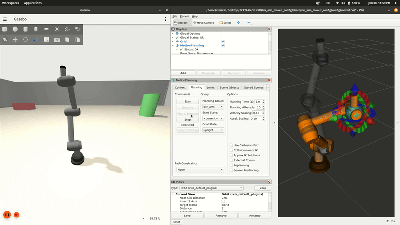
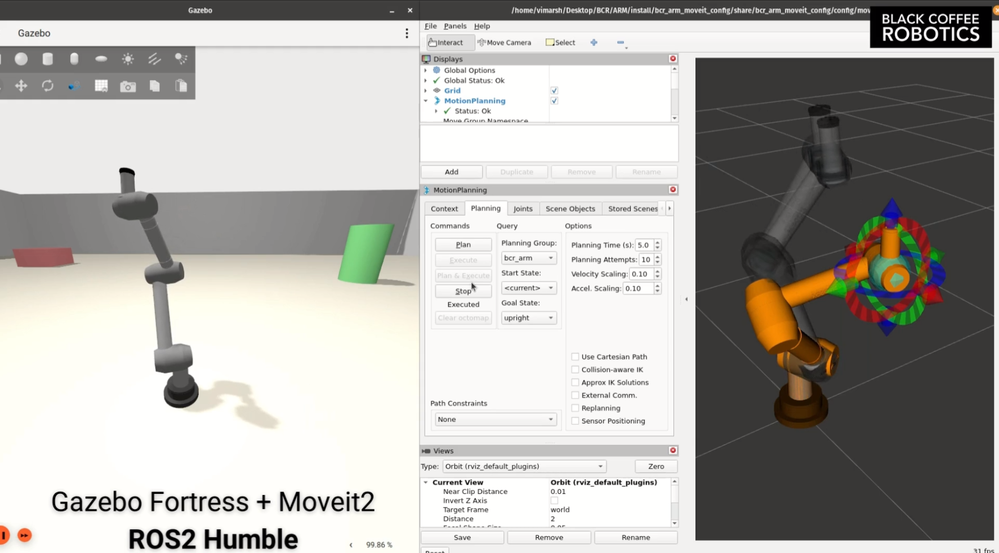
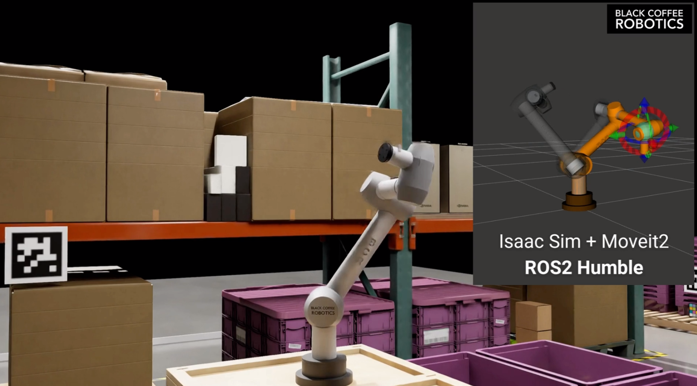
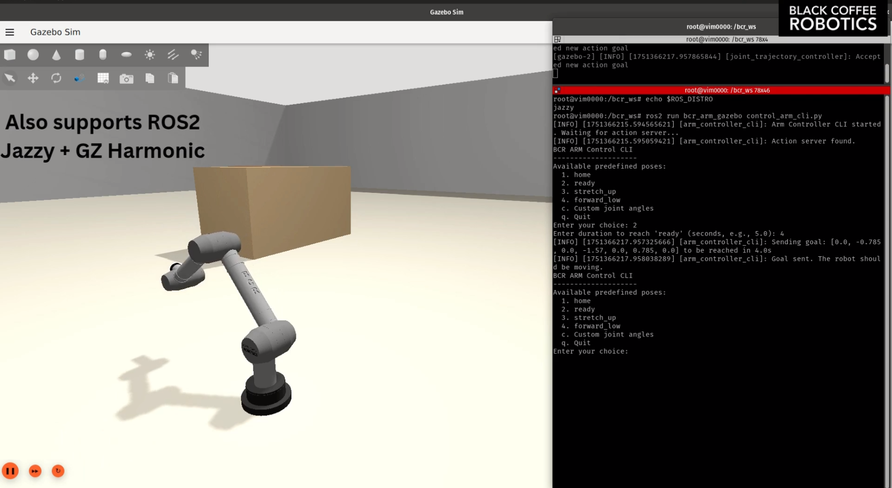

# BCR Arm


https://github.com/user-attachments/assets/8400757d-da8a-446a-a5b3-db223acf94b4


## About

This repository contains a Gazebo Fortress simulation for a 7-DOF robotic arm. It includes ROS2 Control integration and MoveIt for motion planning. Currently, the project supports:

1.  [ROS2 Humble + Gazebo Fortress (Ubuntu 22.04)](https://github.com/blackcoffeerobotics/bcr_arm/tree/ros2/humble)

2. [ROS2 Jazzy + Gazebo Harmonic (Ubuntu 24.04)](https://github.com/blackcoffeerobotics/bcr_arm/tree/ros2/jazzy)

Both versions also support [Nvidia Isaac Sim](https://developer.nvidia.com/isaac/sim)


This branch contains the code and scripts for running on ROS2 Humble + Ignition Gazebo Fortress.

## Humble + Fortress (Ubuntu 22.04)

### Dependencies

Ensure you have ROS2 Humble and Gazebo Fortress installed.

```bash
# Install ROS2 Humble (if not already installed)
sudo apt update
sudo apt install -y ros-humble-desktop

# Install Gazebo Fortress
sudo apt install -y gz-fortress

# Install additional ROS2 packages for control, MoveIt, and Gazebo integration, This skip can be skipped as they will be installed via rosdep later as well.
sudo apt install -y \
    ros-humble-ros-gz \
    ros-humble-ros2-control \
    ros-humble-ros2-controllers \
    ros-humble-gripper-controllers \
    ros-humble-joint-state-publisher-gui \
    ros-humble-robot-state-publisher \
    ros-humble-xacro \
    ros-humble-moveit \
    python3-numpy
```

Project-specific dependencies can be installed using `rosdep`:
```bash
# From the root directory of your workspace (e.g., ~/bcr_ws)
rosdep install --from-paths src --ignore-src -r -y
```

### Source Build

```bash
# Create and navigate to your workspace
mkdir -p ~/bcr_ws/src
cd ~/bcr_ws/src

# Clone the repository
git clone https://gitlab.com/bcr_vimarsh/bcr_arm bcr_arm 
# Ensure your bcr_arm package is in ~/bcr_ws/src/ or appropriate workspace directory

cd ~/bcr_ws

# Build the packages
colcon build --symlink-install

# Source the workspace
source install/setup.bash
```

### Docker Usage (Recommended)

The project includes a complete Docker setup for easy development and testing.

#### Quick Start with Docker

```bash
# Build and run the container (includes GUI support)
./docker/scripts/build_and_run.sh
```

#### Docker Management Scripts

- `build_and_run.sh` - Build image and run container
- `start_container.sh` - Start a detached container
- `stop_container.sh` - Stop the running container  
- `bash_into_container.sh` - Open bash session in running container

#### Inside the Container

Once the container is running, you can run the commands directly from the container.

See the [Docker README](./docker/README.md) for detailed Docker documentation.
### Launch Files

#### 1. Gazebo Simulation with ROS2 Control and MoveIt2 Motion Planning
To launch the Gazebo simulation with ROS2 Control and MoveIt2 for motion planning, use the following command:
```bash
ros2 launch bcr_arm_gazebo bcr_arm.gazebo_moveit.launch.py
```
This starts:
*   Gazebo Fortress with the BCR Arm.
*   ROS2 controllers for the arm.
*   MoveIt2 for motion planning and visualization in RViz.

#### 2. Gazebo Simulation with ROS2 Control

This is the primary launch file to bring up the full simulation environment.
```bash
ros2 launch bcr_arm_gazebo bcr_arm.gazebo.launch.py
```
This starts:
-   Gazebo Fortress with the BCR Arm.
-   ROS2 *mock* controllers for the arm. Use scripts from `bcr_arm_gazebo` to send commands to the arm.

The following argument can be passed to launch the arm in gazebo with another world file: `world_path:=$(ros2 pkg prefix bcr_arm_gazebo --share)/worlds/house.world`

#### 3. MoveIt Demo (Standalone Motion Planning)

To launch MoveIt and RViz for motion planning (typically used with a running simulation or real hardware):
```bash
ros2 launch bcr_arm_moveit_config demo.launch.py
```

#### 4. Isaac Sim + Moveit 

To launch Isaac Sim and use Moveit for motion planning and control.

To launch the robot in Isaac Sim:

- Open Isaac Sim and load the bcr_arm usd from [here](isaacsim/bcr_arm_scene.usd).
- Add in extra viewports for different camera views.
- Start the Simulation: Run the simulation directly within Isaac Sim.

To view and launch moveit:

```bash
ros2 launch bcr_arm_moveit_config isaac_demo.launch.py
```

### Controlling the Arm

Once the simulation with controllers is running (e.g., via `bcr_arm.gazebo.launch.py`), you can send commands.

**Using the CLI Script:**

A Python script is provided to send predefined or custom joint goals.
```bash
# Ensure your workspace is sourced
# ros2 run bcr_arm_gazebo test_arm_movement.py
ros2 run bcr_arm_gazebo control_arm_cli.py
```
Follow the on-screen prompts to select poses or enter custom joint angles.

**Manual Action Commands:**

You can send `FollowJointTrajectory` goals directly:
```bash
ros2 action send_goal /joint_trajectory_controller/follow_joint_trajectory \
  control_msgs/action/FollowJointTrajectory \
  "{trajectory: {joint_names: ['joint1', 'joint2', 'joint3', 'joint4', 'joint5', 'joint6', 'joint7'],
   points: [{positions: [0.0, 0.785, 0.0, -1.57, 0.0, 0.785, 0.0], time_from_start: {sec: 5}}]}}"
```

**Listing Controllers:**
```bash
ros2 control list_controllers
```
This should show `joint_trajectory_controller` and `joint_state_broadcaster` as active.


## Images








